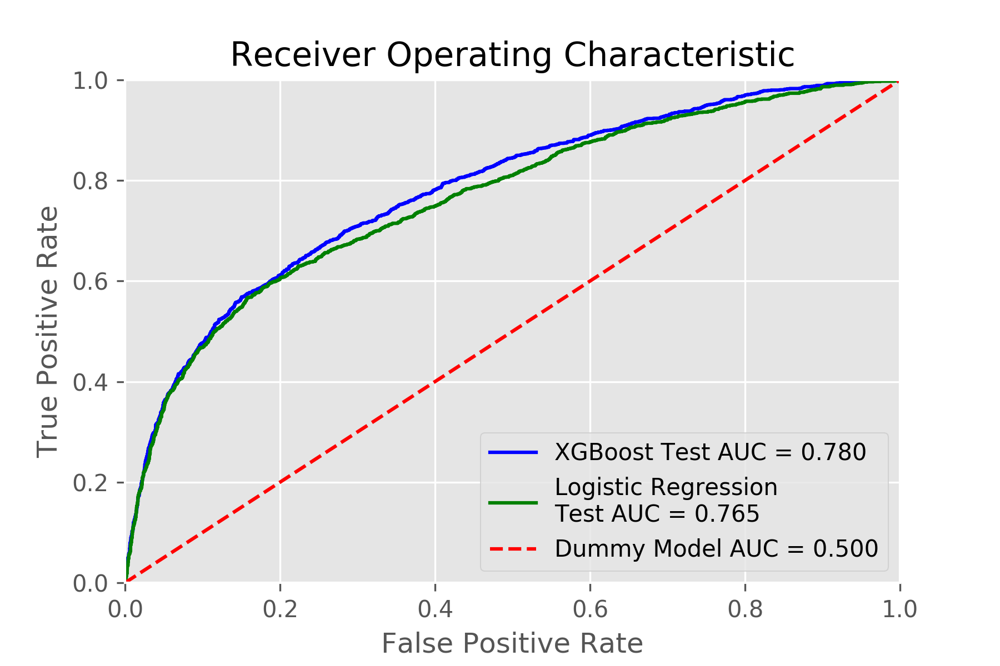

Predicting Credit Card Default with XGBoost
==============================

In this project, I applied gradient boosting models to predict credit card default.  I used a high-performance implementation of the gradient boosting algorithm called [XGBoost](http://xgboost.readthedocs.io/en/latest/model.html).  

XGBoost outperformed logistic regression, which is one of the [most prominent methods](https://www2.deloitte.com/content/dam/Deloitte/global/Documents/Financial-Services/gx-be-aers-fsi-credit-scoring.pdf) for credit scoring.  XGBoost achieved a test ROC AUC score of 0.780, whereas logistic regression achieved a test ROC AUC score of 0.765.

------------

Keywords:  Credit Score; Risk management; Machine learning; Gradient boosting; XGBoost

------------

## Table of Contents

[Background](#background)  
[The Dataset](#the-dataset)  
[Process Overview and Tech Stack](#process-overview-and-tech-stack)   
[Results](#results)   
[Final Report](#final-report)   
[GitHub Folder Structure](#github-folder-structure)  
[References](#references)  
[Acknowledgements](#acknowledgements)

------------

## Background

Machine learning techniques can be an important tool for financial risk management.  Performant and scalable machine learning models that are able to predict the probability of credit card default could bolster the risk management toolkits of credit scoring agencies and credit card originators.  Better credit-score systems could lead to lower overall borrowing costs.  This could benefit both lenders and borrowers.

Logistic regression has been the workhorse of the credit-scoring industry for over half a century.  

>  "Traditional credit-score systems use less than 50 data points to determine creditworthiness. That’s only a fraction of the public data available on any given person." - ZestFinance

Disruptive fintech companies like [ZestFinance](https://www.zestfinance.com/our-story) are developing ways to build better credit-score systems that analyze thousands of data points (as opposed to 50 or so data points) using machine learning.  

------------

## The Dataset

We used an anonymized dataset of Taiwanese credit card holders from October 2005 used by [Yeh & Lien (2009)](https://pdfs.semanticscholar.org/1cac/ac4f0ea9fdff3cd88c151c94115a9fddcf33.pdf).  This dataset was made available to the public and posted on the UC Irvine Machine Learning Repository [website](https://archive.ics.uci.edu/ml/datasets/default%20of%20credit%20card%20clients).  

The dataset contains 30,000 observations.  Each of these observations corresponds to an individual credit card holder.  A binary response variable indicates whether or not an individual defaulted on their credit card payments in October 2005.

The dataset contains 23 features (explanatory variables), such as age, education, credit limit, past payment status, etc.  We expanded this set of 23 features to 92 features using feature engineering.  More details on my feature engineering process can be found in the [final report](#final-report).

------------

## Process Overview and Tech Stack

------------

## Results

XGBoost outperformed logistic regression, which is one of the [most prominent methods](https://www2.deloitte.com/content/dam/Deloitte/global/Documents/Financial-Services/gx-be-aers-fsi-credit-scoring.pdf) for credit scoring.  XGBoost achieved a test ROC AUC score of 0.780, whereas logistic regression achieved a test ROC AUC score of 0.765.  This is illustrated in the following chart.

<!---  

--->

------------

## Final Report

The final report for the project can be found [here](https://github.com/zkneupper/Default-Prediction-Capstone/blob/master/reports/Final_Report.pdf).

------------

## GitHub Folder Structure

    ├── LICENSE
    ├── README.md          <- The top-level README for this project.
    ├── data
    │   ├── external       <- Data from third party sources.
    │   ├── interim        <- Intermediate data that has been transformed.    
    │   ├── processed      <- The final, canonical data sets for modeling.
    │   └── raw            <- The original, immutable data dump.
    │
    ├── models             <- Trained and serialized models
    │
    ├── notebooks          <- Jupyter notebooks.
    │
    ├── reports            <- Generated analysis as PDF reports and Jupyter notebooks.
    │   └── figures        <- Generated graphics and figures to be used in reporting
    │   └── images    
    │
    └── src                <- Source code for use in this project.
        ├── __init__.py    <- Makes src a Python module
        │
        ├── data           <- Scripts to download or generate data
        │   └── make_dataset.py
        │
        ├── features       <- Scripts to turn raw data into features for modeling
        │   └── build_features.py
        │
        └── models         <- Scripts to train models and then use trained models to make
            │                 predictions
            ├── predict_model.py
            └── train_model.py

------------

## References

1. [I-Cheng Yeh, and Che-Hui Lien. "The comparisons of data mining techniques for the predictive accuracy of probability of default of credit card clients." Expert Systems with Applications 36, no. 2 (2009)](https://pdfs.semanticscholar.org/1cac/ac4f0ea9fdff3cd88c151c94115a9fddcf33.pdf)
2. [Credit Card Default Data Set on the UCI Machine Learning Repository](https://archive.ics.uci.edu/ml/datasets/default%20of%20credit%20card%20clients)
3. [Introduction to Boosted Trees](http://xgboost.readthedocs.io/en/latest/model.html)
4. [www.zestfinance.com](www.zestfinance.com)

------------

## Acknowledgements

This was one of my capstone projects for the Data Science Career Track program at [Springboard](https://www.springboard.com/workshops/data-science-career-track).  

I would like to thank my mentor Kenneth Gil-Pasquel for his guidance and feedback.  

------------
